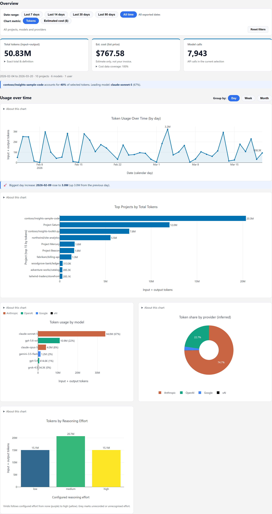
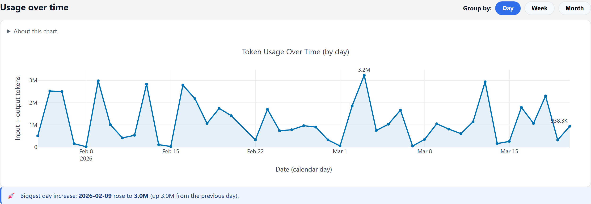
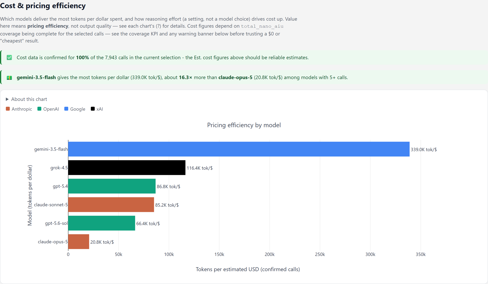
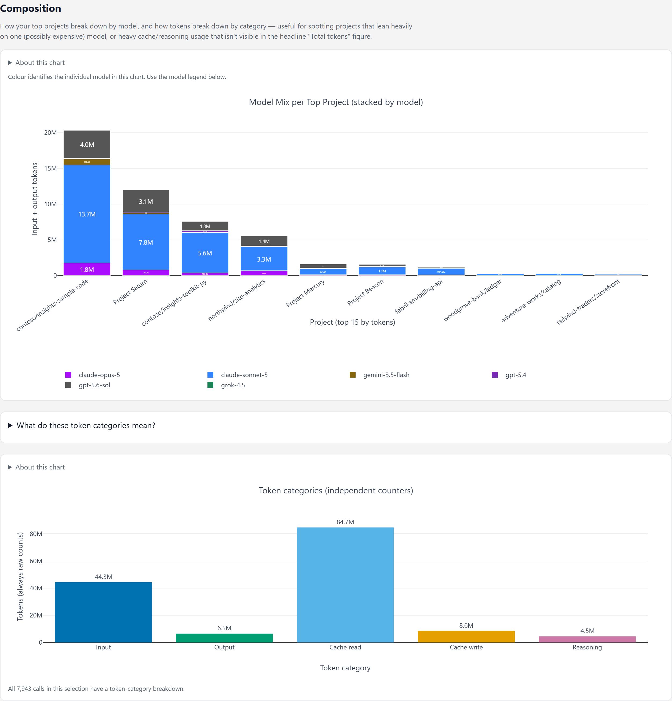

# Copilot CLI Usage Dashboard

[](https://github.com/microsoft/ghc-cli-dashboard/actions/workflows/test.yml)
[](LICENSE.txt)
[](docs/compatibility.md)

An experimental local dashboard for exploring GitHub Copilot CLI usage. It
reads the CLI session store, exports aggregate usage data to CSV, and creates
a self-contained HTML dashboard.

The local session-store schema is not a stable public API. Copilot CLI updates
can change the extractor's assumptions. See
[Compatibility and data format](docs/compatibility.md).

## Quick start

Requirements:

- Python 3.9 or later
- GitHub Copilot CLI session data on the local machine

```powershell
git clone https://github.com/microsoft/ghc-cli-dashboard.git
cd ghc-cli-dashboard
python -m pip install -r requirements.txt

python extract_usage.py
python dashboard.py --in "copilot_usage_*.csv" --out usage_dashboard.html
```

Open `usage_dashboard.html` in a browser.

Task summaries are included by default, since this tool is meant for
personal viewing and the Work patterns view relies on them. Pass
`--exclude-task-summary` to `extract_usage.py` if you'd rather leave them
out, and review the privacy implications before sharing a CSV or dashboard.

## What it shows

- Token usage and estimated list-price cost by project, model, and provider.
- Trends by day, week, or month.
- Input, output, cache, and reasoning token categories.
- Model mix, provider mix, reasoning effort, and task detail.
- Optional local subject discovery (one primary plus additional subjects),
  independent deliverable labels, and per-session corrections, with
  usage and existing cost totals by topic.

The dashboard estimates cost from usage data recorded by Copilot CLI. It does
not represent an invoice.

### What's new in this revision

- Filter-aware **Session explorer** with per-session usage, cost, and cost
  coverage, plus a distinct-session headline metric.
- **Period / Cumulative** usage trends for tokens or estimated cost; chart
  zoom filters the entire dashboard, not just the chart.
- Optional local multi-topic classification: a primary subject, up to two
  additional subjects, and independent deliverable types per session.
- Editable topic **families** and multi-select family, topic, and deliverable
  filters. Choices narrow one another as dates and other filters change.
  Session cost remains attributed to its primary subject only.

### Optional topics

Install the optional, local embedding model support:

```powershell
python -m pip install -r requirements-topics.txt
python extract_usage.py --out usage.csv `
  --db "C:\first\.copilot\session-store.db" `
  --db "D:\other\.copilot\session-store.db"
python dashboard.py --in usage.csv --topics --serve
```

Open the localhost URL printed by `dashboard.py`. The **Topics** section
shows discovered groups and lets you create or rename topics, merge groups,
and correct individual session assignments. These changes are saved to
`~/.ghc-cli-dashboard/topics.json` and reused on the next dashboard build.
Use `--topics-file PATH` to choose another local catalog. For a static,
read-only HTML export, omit `--serve`.

The model downloads once on first use (roughly 67 MB), then processes
summaries locally. No session text is sent to a classification service, and
nothing runs in the Copilot request path. Automatic labels are suggestions.
See [topic classification and source selection](docs/advanced-usage.md#topic-classification).

### Multi-topic and family workflow (opt-in)

For richer subjects when stored task summaries are generic, install
`requirements-topics.txt` as above. Install [Ollama](https://ollama.com/)
separately, start its local service, and explicitly run
`ollama pull gpt-oss:20b` (about 12 GB of model weights). Then, from this
repository in PowerShell, run:

```powershell
python extract_usage.py --out usage.csv
python topic_summarizer.py --in usage.csv --out usage-multi.csv `
  --db "$HOME/.copilot/session-store.db" `
  --multi-topic --ollama-model gpt-oss:20b --workers 4 `
  --cache topic-ollama-cache.json
python dashboard.py --in usage-multi.csv --topics-file topics-multi.json `
  --out usage_dashboard.html
python topic_families.py --catalog topics-multi.json --ollama-model gpt-oss:20b
python dashboard.py --in usage-multi.csv --topics-file topics-multi.json `
  --out usage_dashboard.html --serve
```

Open the localhost URL printed by the final command to edit topics, families,
and session assignments; omit `--serve` for a read-only HTML file. If you use
more than one Copilot home, add the same `--db PATH` arguments to **both**
extraction and summarization, in the same order. The first database wins if
session IDs overlap. The CSV's `topic_status` and `topic_review` columns
identify uncertain or failed classifications to review. Rerun the summarizer
to process new sessions from its private cache, then rebuild the dashboard;
rerun the family pass to classify newly discovered topics. Family assignments
never merge topics or costs.

Neither model installation nor multi-topic or family classification happens
automatically when someone opens the dashboard. For a smaller, explicitly
downloaded GGUF model instead of Ollama, install
`requirements-summaries.txt` and see the
[offline SLM instructions](docs/advanced-usage.md#optional-offline-slm-summaries).
The Ollama pipeline and editor have been exercised on macOS; native Windows
inference has not yet been verified.

### Exploring your usage

The overview puts date and metric controls above four headline metrics
(tokens, estimated cost, model calls, and distinct identified sessions) and
the usage trend. Cost coverage is attached to the cost card, with incomplete
coverage expanded automatically. Expand the token card for its exact total
and definition.

In **Usage over time**, choose **Period** for per-day/week/month totals or
**Cumulative** for a running total within the selected date range. Empty
periods stay flat; the hover shows both the period amount and running total.
The same switch works for tokens and estimated cost.
Dragging to zoom on the usage trend sets a custom date range for the
entire dashboard, including family/topic/deliverable choices and session totals.
Double-click the trend or choose **All time** to clear the zoom.

The **Session explorer** lists individual sessions and their estimated costs
within the current filters. Click a session to inspect its model/day usage, or
click a project, model, topic, provider, or time-period chart entry to narrow
the list. Use its grouping and search controls for other breakdowns. It is
available in the standalone HTML; prompt-level detail is not exported.
Select multiple topics, families, or deliverables to match **any** choice
within that filter; different filter groups combine together. Selecting
topics also narrows the available families, and selecting a family narrows
the available topics. The time control selects one window at a time.

Search projects or models in the filter panel, use **Only** to select one
item in a group, or **Show more** to browse beyond the first eight items.
**Reset filters** includes all projects, models, providers and dates. Search
only changes which filter options are visible, not the usage being shown.
The sidebar has its own **Hide filters** control. When collapsed, a narrow
reopen rail stays available as you scroll, and the choice is remembered on
reload. On narrow screens, **Show filters** expands the panel below the controls.
Collapsing hides the filter list only, not project names in charts or tables.

Models use their provider's colour consistently across rankings and pricing
efficiency. **Model Mix per Top Project** is an exception: its categorical
palette assigns a distinct colour to each model so its legend is unambiguous.
Anthropic is terracotta, OpenAI is teal,
Google is blue, xAI is black, and unknown providers are grey. Other charts use
palettes matched to the data: Okabe-Ito for categories, Viridis for continuous
heatmaps and ordered reasoning-effort levels, and one blue for aggregate
totals and trends.
See [filter behaviour](docs/advanced-usage.md#filters-and-providers) for details.

### Screenshots

All screenshots use synthetic data generated by
[`tools/make_sample_data.py`](https://github.com/microsoft/ghc-cli-dashboard/blob/main/tools/make_sample_data.py).
No real usage data is shown.

Headline numbers, usage trend, top projects, and model and provider mix:



Usage over time, with daily, weekly, and monthly grouping:



Estimated cost against usage, to show where spend concentrates:



Token categories, including an explainer for cache read and cache write:



## Privacy

The export CSV and generated dashboard can contain usernames, project names,
session IDs, dates, models, and optional task summaries. Generated HTML
embeds its source rows.

Review files before sharing them. Use build-time redaction when needed:

```powershell
python dashboard.py --in "copilot_usage_*.csv" --out shared_dashboard.html `
  --exclude-project "Personal Project" `
  --omit-task-summaries
```

The `.gitignore` excludes documented generated CSV, HTML, catalog, and cache
files. Topic-enabled HTML also contains generated session summaries, and the
topic catalog contains session IDs and example labels. Keep these outputs
private; do not commit or share them without reviewing and redacting the
underlying data.
See [Advanced usage](docs/advanced-usage.md) for sharing, redaction, and
combining multiple exports.

## Documentation

| Topic | Guide |
| --- | --- |
| Compatibility, CSV format, and schema boundary | [Compatibility and data format](docs/compatibility.md) |
| Token fields and cost estimates | [Token and cost data](docs/token-and-costs.md) |
| Privacy, redaction, filters, providers, and combined exports | [Advanced usage](docs/advanced-usage.md) |
| Development and tests | [Development](docs/development.md) |

## Dependencies

The project uses [pandas](https://pandas.pydata.org/) for data processing and
[Plotly](https://plotly.com/python/) for charts. Generated dashboards bundle
Plotly.js so they can open without a web server.

## Contributing and support

- [Contributing](CONTRIBUTING.md)
- [Support](SUPPORT.md)
- [Security reporting](SECURITY.md)
- [Code of Conduct](CODE_OF_CONDUCT.md)
- [MIT License](LICENSE.txt)

## Telemetry

This project does not collect, transmit, or enable telemetry. It reads local
files and writes local CSV and HTML files.

## Trademarks

This project may contain trademarks or logos for projects, products, or
services. Authorized use of Microsoft trademarks or logos is subject to and
must follow [Microsoft's Trademark & Brand Guidelines](https://www.microsoft.com/legal/intellectualproperty/trademarks/usage/general.aspx).
Use of Microsoft trademarks or logos in modified versions of this project must
not cause confusion or imply Microsoft sponsorship. Any use of third-party
trademarks or logos is subject to those third-party's policies.
